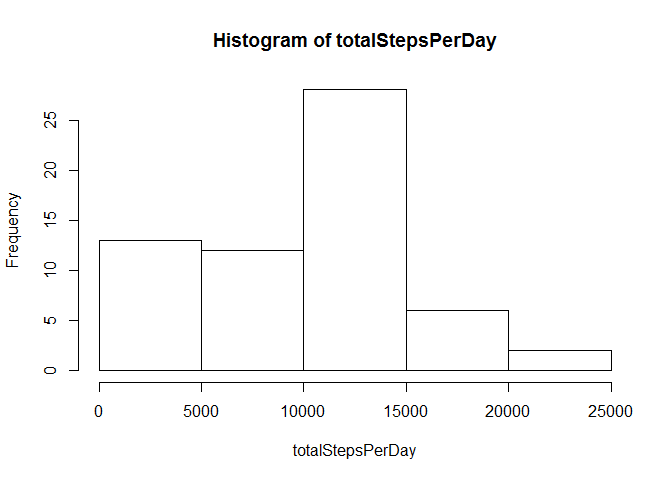
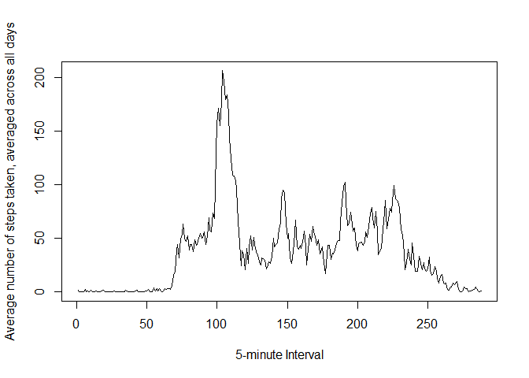
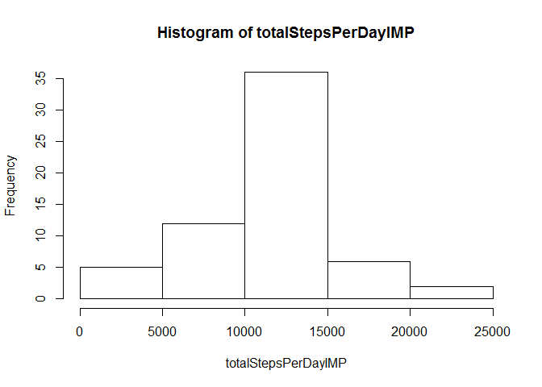

# Reproducible Research: Peer Assessment 1


## Loading and preprocessing the data


We will first read the activity *.csv file into R.
The date column is set to the Date class in R, to be able 
to use date functions to process the data.


```r
 activity <- read.csv("activity.csv")
 activity$date <- as.Date(activity$date)
```


## What is mean total number of steps taken per day?

We first create a vector of the days that are part of the dataset.


```r
 daysequence <- seq(activity$date[1], activity$date[length(activity$date)],"day")

 daysequence
```

```
##  [1] "2012-10-01" "2012-10-02" "2012-10-03" "2012-10-04" "2012-10-05"
##  [6] "2012-10-06" "2012-10-07" "2012-10-08" "2012-10-09" "2012-10-10"
## [11] "2012-10-11" "2012-10-12" "2012-10-13" "2012-10-14" "2012-10-15"
## [16] "2012-10-16" "2012-10-17" "2012-10-18" "2012-10-19" "2012-10-20"
## [21] "2012-10-21" "2012-10-22" "2012-10-23" "2012-10-24" "2012-10-25"
## [26] "2012-10-26" "2012-10-27" "2012-10-28" "2012-10-29" "2012-10-30"
## [31] "2012-10-31" "2012-11-01" "2012-11-02" "2012-11-03" "2012-11-04"
## [36] "2012-11-05" "2012-11-06" "2012-11-07" "2012-11-08" "2012-11-09"
## [41] "2012-11-10" "2012-11-11" "2012-11-12" "2012-11-13" "2012-11-14"
## [46] "2012-11-15" "2012-11-16" "2012-11-17" "2012-11-18" "2012-11-19"
## [51] "2012-11-20" "2012-11-21" "2012-11-22" "2012-11-23" "2012-11-24"
## [56] "2012-11-25" "2012-11-26" "2012-11-27" "2012-11-28" "2012-11-29"
## [61] "2012-11-30"
```

The "day" parameter makes the sequence list each day only once while reading the ``` activity$date ``` column.


```r
 totalStepsPerDay <- numeric(length(daysequence))
for(i in 1:length(daysequence)){
     
     daystoadd <- activity$steps[(activity$date == daysequence[i])]
     
     totalStepsPerDay[i] <- sum(daystoadd, na.rm=TRUE)
     
     
 }
```


```r
 hist(totalStepsPerDay)
```

 


```r
 mean(totalStepsPerDay)
```

```
## [1] 9354
```

```r
 median(totalStepsPerDay)
```

```
## [1] 10395
```

```r
 summary(totalStepsPerDay)
```

```
##    Min. 1st Qu.  Median    Mean 3rd Qu.    Max. 
##       0    6780   10400    9350   12800   21200
```

## What is the average daily activity pattern?


```r
activity.DF <- data.frame(activity)

activity_mean_min <- aggregate(activity.DF[,1], by=list(activity.DF$date,activity.DF$interval), FUN=mean)

colnames(activity_mean_min) <- c("Date", "Interval", "Steps")
```


```r
intervalsequence <- activity$interval[(activity$date == daysequence[1])]

mean_steps_interval <- numeric(length(intervalsequence))

for(j in 1:length(intervalsequence)){
     
    intervaltoavg <- activity_mean_min$Steps[(activity_mean_min$Interval == intervalsequence[j])]
    
	  mean_steps_interval[j] <- mean(intervaltoavg, na.rm=TRUE)
     
     
}
```


```r
 plot(1:length(mean_steps_interval), mean_steps_interval, 
      type="l", xlab="5-minute Interval", ylab="Average number of steps taken, averaged across all days")
```

 


```r
 summary(mean_steps_interval)
```

```
##    Min. 1st Qu.  Median    Mean 3rd Qu.    Max. 
##    0.00    2.49   34.10   37.40   52.80  206.00
```

```r
 mean_steps_interval
```

```
##   [1]   1.71698   0.33962   0.13208   0.15094   0.07547   2.09434   0.52830
##   [8]   0.86792   0.00000   1.47170   0.30189   0.13208   0.32075   0.67925
##  [15]   0.15094   0.33962   0.00000   1.11321   1.83019   0.16981   0.16981
##  [22]   0.37736   0.26415   0.00000   0.00000   0.00000   1.13208   0.00000
##  [29]   0.00000   0.13208   0.00000   0.22642   0.00000   0.00000   1.54717
##  [36]   0.94340   0.00000   0.00000   0.00000   0.00000   0.20755   0.62264
##  [43]   1.62264   0.58491   0.49057   0.07547   0.00000   0.00000   1.18868
##  [50]   0.94340   2.56604   0.00000   0.33962   0.35849   4.11321   0.66038
##  [57]   3.49057   0.83019   3.11321   1.11321   0.00000   1.56604   3.00000
##  [64]   2.24528   3.32075   2.96226   2.09434   6.05660  16.01887  18.33962
##  [71]  39.45283  44.49057  31.49057  49.26415  53.77358  63.45283  49.96226
##  [78]  47.07547  52.15094  39.33962  44.01887  44.16981  37.35849  49.03774
##  [85]  43.81132  44.37736  50.50943  54.50943  49.92453  50.98113  55.67925
##  [92]  44.32075  52.26415  69.54717  57.84906  56.15094  73.37736  68.20755
##  [99] 129.43396 157.52830 171.15094 155.39623 177.30189 206.16981 195.92453
## [106] 179.56604 183.39623 167.01887 143.45283 124.03774 109.11321 108.11321
## [113] 103.71698  95.96226  66.20755  45.22642  24.79245  38.75472  34.98113
## [120]  21.05660  40.56604  26.98113  42.41509  52.66038  38.92453  50.79245
## [127]  44.28302  37.41509  34.69811  28.33962  25.09434  31.94340  31.35849
## [134]  29.67925  21.32075  25.54717  28.37736  26.47170  33.43396  49.98113
## [141]  42.03774  44.60377  46.03774  59.18868  63.86792  87.69811  94.84906
## [148]  92.77358  63.39623  50.16981  54.47170  32.41509  26.52830  37.73585
## [155]  45.05660  67.28302  42.33962  39.88679  43.26415  40.98113  46.24528
## [162]  56.43396  42.75472  25.13208  39.96226  53.54717  47.32075  60.81132
## [169]  55.75472  51.96226  43.58491  48.69811  35.47170  37.54717  41.84906
## [176]  27.50943  17.11321  26.07547  43.62264  43.77358  30.01887  36.07547
## [183]  35.49057  38.84906  45.96226  47.75472  48.13208  65.32075  82.90566
## [190]  98.66038 102.11321  83.96226  62.13208  64.13208  74.54717  63.16981
## [197]  56.90566  59.77358  43.86792  38.56604  44.66038  45.45283  46.20755
## [204]  43.67925  46.62264  56.30189  50.71698  61.22642  72.71698  78.94340
## [211]  68.94340  59.66038  75.09434  56.50943  34.77358  37.45283  40.67925
## [218]  58.01887  74.69811  85.32075  59.26415  67.77358  77.69811  74.24528
## [225]  85.33962  99.45283  86.58491  85.60377  84.86792  77.83019  58.03774
## [232]  53.35849  36.32075  20.71698  27.39623  40.01887  30.20755  25.54717
## [239]  45.66038  33.52830  19.62264  19.01887  19.33962  33.33962  26.81132
## [246]  21.16981  27.30189  21.33962  19.54717  21.32075  32.30189  20.15094
## [253]  15.94340  17.22642  23.45283  19.24528  12.45283   8.01887  14.66038
## [260]  16.30189   8.67925   7.79245   8.13208   2.62264   1.45283   3.67925
## [267]   4.81132   8.50943   7.07547   8.69811   9.75472   2.20755   0.32075
## [274]   0.11321   1.60377   4.60377   3.30189   2.84906   0.00000   0.83019
## [281]   0.96226   1.58491   2.60377   4.69811   3.30189   0.64151   0.22642
## [288]   1.07547
```

```r
 which.max(mean_steps_interval)
```

```
## [1] 104
```

```r
  mean_steps_interval[which.max(mean_steps_interval)]
```

```
## [1] 206.2
```

```r
 intervalsequence[which.max(mean_steps_interval)]
```

```
## [1] 835
```
 

## Imputing missing values


```r
 length(which(is.na(activity_mean_min)==TRUE))
```

```
## [1] 2304
```

```r
  mean_days <- numeric(length(daysequence))
 
 for(i in 1:length(daysequence)){

  daystoavg <- activity$steps[(activity$date == daysequence[i])]

	mean_days[i] <- mean(daystoavg, na.rm=TRUE)


}

mean_days
```

```
##  [1]     NaN  0.4375 39.4167 42.0694 46.1597 53.5417 38.2465     NaN
##  [9] 44.4826 34.3750 35.7778 60.3542 43.1458 52.4236 35.2049 52.3750
## [17] 46.7083 34.9167 41.0729 36.0938 30.6285 46.7361 30.9653 29.0104
## [25]  8.6528 23.5347 35.1354 39.7847 17.4236 34.0938 53.5208     NaN
## [33] 36.8056 36.7049     NaN 36.2465 28.9375 44.7326 11.1771     NaN
## [41]     NaN 43.7778 37.3785 25.4722     NaN  0.1424 18.8924 49.7882
## [49] 52.4653 30.6979 15.5278 44.3993 70.9271 73.5903 50.2708 41.0903
## [57] 38.7569 47.3819 35.3576 24.4688     NaN
```

```r
NAdays <- daysequence[is.nan(mean_days)]

NAdays
```

```
## [1] "2012-10-01" "2012-10-08" "2012-11-01" "2012-11-04" "2012-11-09"
## [6] "2012-11-10" "2012-11-14" "2012-11-30"
```


```r
for(k in 1:length(NAdays)){
     
     activity.DF$steps[(activity.DF$date == NAdays[k])] <- mean_steps_interval
     
     
 }
 
 
 totalStepsPerDayIMP <- numeric(length(daysequence))
for(i in 1:length(daysequence)){
     
     daystoadd <- activity.DF$steps[(activity.DF$date == daysequence[i])]
     
     totalStepsPerDayIMP[i] <- sum(daystoadd, na.rm=TRUE)
     
     
 }
```


```r
 hist(totalStepsPerDayIMP)
```

 

```r
 mean(totalStepsPerDayIMP)
```

```
## [1] 10766
```

```r
 median(totalStepsPerDayIMP)
```

```
## [1] 10766
```

```r
 summary(totalStepsPerDayIMP)
```

```
##    Min. 1st Qu.  Median    Mean 3rd Qu.    Max. 
##      41    9820   10800   10800   12800   21200
```


## Are there differences in activity patterns between weekdays and weekends?


```r
 dayfactor <- character(length(activity$date))
 
 for(j in 1:length(activity.DF$date)){

  if((weekdays(activity.DF$date[j])=="Saturday")|(weekdays(activity.DF$date[j])=="Sunday"))
  	dayfactor[j] <- "weekend"
	else
		dayfactor[j] <- "weekday"
		
}	

 activity.DF <- cbind(activity.DF, dayfactor)
```


```r
 require(lattice)
```

```
## Loading required package: lattice
```

```r
 p <- xyplot(steps ~ interval | dayfactor, data = activity.DF, type = "l", layout=c(1,2,1))
 print(p)
```

 


 
