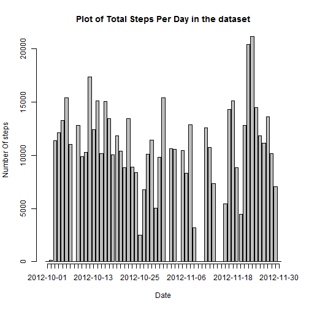
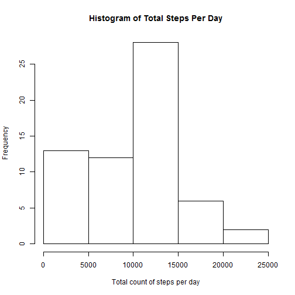
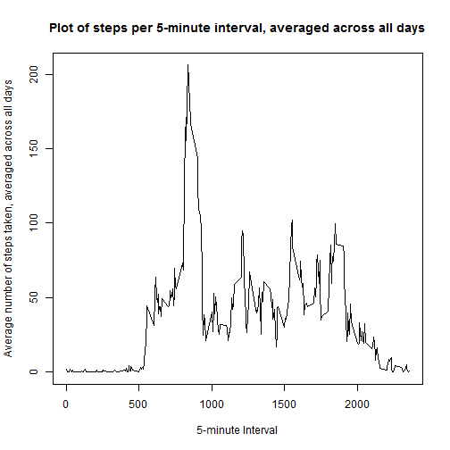
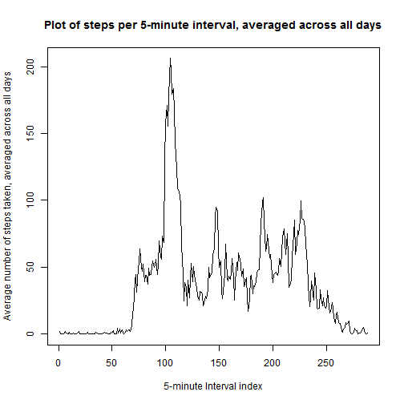
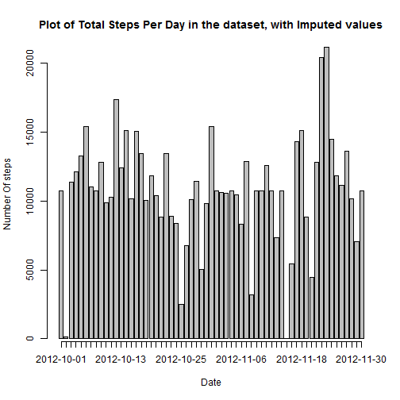
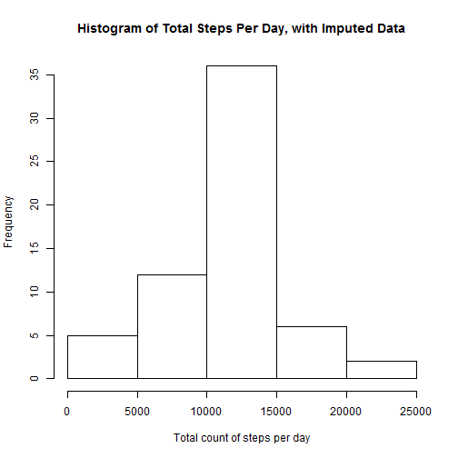
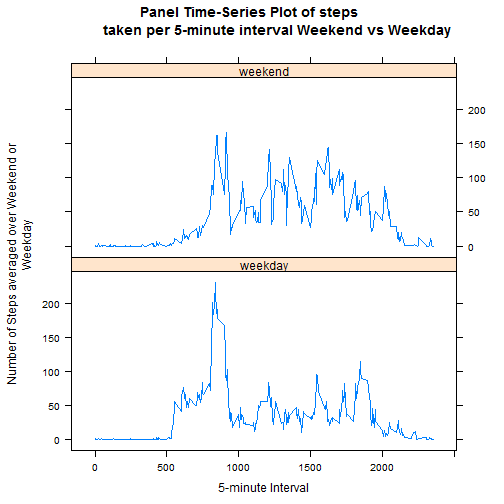
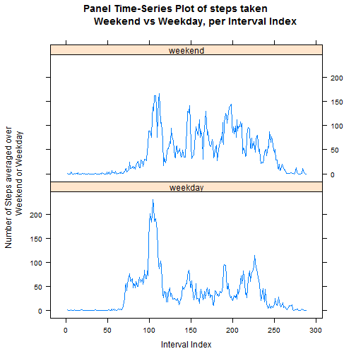

# Reproducible Research: Peer Assessment 1


## Loading and preprocessing the data


The activity *.csv file is first read into R. The date column is set to the Date class in R. This enables the use of date functions to process the data.

### ANSWER 1 and 2 for this section


```r
 activity <- read.csv("activity.csv")
 activity$date <- as.Date(activity$date)
```

Options are set to ensure the display of real numbers is consistent.


```r
 options("scipen"=100, "digits"=4)
```


## What is the mean total number of steps taken per day?

### Analysis

Create a vector of the days that are part of the dataset. Using the "day" option in the seq() function creates a list of unique days in the date set. 

(The "day" parameter makes the sequence list each day only once while reading the ``` activity$date ``` column.)


```r
 daysequence <- seq(activity$date[1], activity$date[length(activity$date)],"day")
```

The resulting vector is displayed for completeness.


```r
 daysequence
```

```
##  [1] "2012-10-01" "2012-10-02" "2012-10-03" "2012-10-04" "2012-10-05"
##  [6] "2012-10-06" "2012-10-07" "2012-10-08" "2012-10-09" "2012-10-10"
## [11] "2012-10-11" "2012-10-12" "2012-10-13" "2012-10-14" "2012-10-15"
## [16] "2012-10-16" "2012-10-17" "2012-10-18" "2012-10-19" "2012-10-20"
## [21] "2012-10-21" "2012-10-22" "2012-10-23" "2012-10-24" "2012-10-25"
## [26] "2012-10-26" "2012-10-27" "2012-10-28" "2012-10-29" "2012-10-30"
## [31] "2012-10-31" "2012-11-01" "2012-11-02" "2012-11-03" "2012-11-04"
## [36] "2012-11-05" "2012-11-06" "2012-11-07" "2012-11-08" "2012-11-09"
## [41] "2012-11-10" "2012-11-11" "2012-11-12" "2012-11-13" "2012-11-14"
## [46] "2012-11-15" "2012-11-16" "2012-11-17" "2012-11-18" "2012-11-19"
## [51] "2012-11-20" "2012-11-21" "2012-11-22" "2012-11-23" "2012-11-24"
## [56] "2012-11-25" "2012-11-26" "2012-11-27" "2012-11-28" "2012-11-29"
## [61] "2012-11-30"
```

There are **61** total days in the dataset.


```r
length(daysequence)
```

```
## [1] 61
```

There are **288** 5-minute intervals in each day.


```r
length(activity$date)/length(daysequence)
```

```
## [1] 288
```

This equals the number of 5-minute intervals in a 24 hour period.


```r
24*60/5
```

```
## [1] 288
```

A numeric vector with length equal to the number of unique days is created to hold the total steps per day.

The ```for``` loop then adds up all steps for each day in the sequence.


```r
totalStepsPerDay <- numeric(length(daysequence))

for(i in 1:length(daysequence)){
     
     daystoadd <- activity$steps[(activity$date == daysequence[i])]
     
     totalStepsPerDay[i] <- sum(daystoadd, na.rm=TRUE)
          
 }
```

A barplot of total steps per day is created, by first setting up the labels for readability. Please note that each tick corresponds to a day in the ```daysequence``` vector displayed earlier. Note that this is for clarity, as will be described later. The barplot shows the steps for each day, where a histogram would show the *frequency* of a total steps count in the whole vector.


```r
Plotlabs <- seq(min(daysequence), max(daysequence), by="day")

Plotlabs.pos <- round(seq(1, length(daysequence), length.out=length(daysequence)))

mp <- barplot(totalStepsPerDay, xaxt="n", main="Plot of Total Steps Per Day in the dataset",
                xlab="Date", ylab="Number Of steps")

axis(1, at=mp, labels=Plotlabs)
```

 

**This barplot is shown to get a sense of the dataset, but was not required by the assignment.**

### ANSWER 1 for this section

This is the histogram required for the assignment. Note that it shows the frequencies for counts that fall in each of the "Sturges" bins. See ```?hist``` for details.


```r
hist(totalStepsPerDay, main="Histogram of Total Steps Per Day", xlab="Total count of steps per day")
```

 


### ANSWER 2 for this section

The **mean** and **median** of the total number of steps per day are calculated. 

The **mean** of total steps per day is 9354.2295, and the **median** is 10395.


```r
 mean(totalStepsPerDay)
```

```
## [1] 9354
```


```r
 median(totalStepsPerDay)
```

```
## [1] 10395
```

The **summary** is also displayed for completeness.


```r
 summary(totalStepsPerDay)
```

```
##    Min. 1st Qu.  Median    Mean 3rd Qu.    Max. 
##       0    6780   10400    9350   12800   21200
```

## What is the average daily activity pattern?

### Analysis

The ```aggregate``` function is used to rearrange the data into a data frame organized by *interval* and not by *date*. The first few items of the resulting data frame will be shown to validate this transformation.


```r
activity.DF <- data.frame(activity)

activity_mean_min <- aggregate(activity.DF[,1], by=list(activity.DF$date,activity.DF$interval), FUN=mean)
```

Reset the column names vector for clarity.


```r
colnames(activity_mean_min) <- c("Date", "Interval", "Steps")
```

Display the first few items in the data frame to show the effect.


```r
head(activity_mean_min)
```

```
##         Date Interval Steps
## 1 2012-10-01        0    NA
## 2 2012-10-02        0     0
## 3 2012-10-03        0     0
## 4 2012-10-04        0    47
## 5 2012-10-05        0     0
## 6 2012-10-06        0     0
```

Create vector to hold the sequence of intervals by subsetting by one date (the first day, but it would work with any day).

A numeric vector with length equal to the number of 5-minute intervals is then created to hold the mean steps per interval.

The ```for``` loop then takes the arithmetic mean for each interval in the sequence.


```r
intervalsequence <- activity$interval[(activity$date == daysequence[1])]

mean_steps_interval <- numeric(length(intervalsequence))

for(j in 1:length(intervalsequence)){
     
    intervaltoavg <- activity_mean_min$Steps[(activity_mean_min$Interval == intervalsequence[j])]
    
	  mean_steps_interval[j] <- mean(intervaltoavg, na.rm=TRUE)    
     
}
```

This is the plot of the average number of steps taken in a specific 5-minute interval, where the average is taken for that interval across all days in the dataset.


### ANSWER 1 for this section


```r
 plot(activity$interval[1:length(mean_steps_interval)], mean_steps_interval, 
      type="l", main="Plot of steps per 5-minute interval, averaged across all days", 
      xlab="5-minute Interval", 
      ylab="Average number of steps taken, averaged across all days")
```

 

*Note that the following plot is made by interval **index*** *and not by interval "identifier". The index ```1:288``` is continuous and will yield consistent plots very simply, using the "identifier" ```0, 5, ..., 2355``` can yield discontinuities in some plots unless labels and axes are modified. The plot above looks similar but has some discontinuities*


```r
 plot(1:length(mean_steps_interval), mean_steps_interval, 
      type="l", main="Plot of steps per 5-minute interval, averaged across all days", 
      xlab="5-minute Interval index", 
      ylab="Average number of steps taken, averaged across all days")
```

 

Both plots are shown because it not obvious from the problem statement which would be expected. Both seem acceptable, and the issues a factor of the identifiers used for the intervals, given that there **are** **288** 5-minute intervals in a 24 hour period, as shown previously.


The six number summary for the vector plotted above.


```r
 summary(mean_steps_interval)
```

```
##    Min. 1st Qu.  Median    Mean 3rd Qu.    Max. 
##    0.00    2.49   34.10   37.40   52.80  206.00
```

This is the vector of average steps per interval used in the plot above.


```r
 mean_steps_interval
```

```
##   [1]   1.71698   0.33962   0.13208   0.15094   0.07547   2.09434   0.52830
##   [8]   0.86792   0.00000   1.47170   0.30189   0.13208   0.32075   0.67925
##  [15]   0.15094   0.33962   0.00000   1.11321   1.83019   0.16981   0.16981
##  [22]   0.37736   0.26415   0.00000   0.00000   0.00000   1.13208   0.00000
##  [29]   0.00000   0.13208   0.00000   0.22642   0.00000   0.00000   1.54717
##  [36]   0.94340   0.00000   0.00000   0.00000   0.00000   0.20755   0.62264
##  [43]   1.62264   0.58491   0.49057   0.07547   0.00000   0.00000   1.18868
##  [50]   0.94340   2.56604   0.00000   0.33962   0.35849   4.11321   0.66038
##  [57]   3.49057   0.83019   3.11321   1.11321   0.00000   1.56604   3.00000
##  [64]   2.24528   3.32075   2.96226   2.09434   6.05660  16.01887  18.33962
##  [71]  39.45283  44.49057  31.49057  49.26415  53.77358  63.45283  49.96226
##  [78]  47.07547  52.15094  39.33962  44.01887  44.16981  37.35849  49.03774
##  [85]  43.81132  44.37736  50.50943  54.50943  49.92453  50.98113  55.67925
##  [92]  44.32075  52.26415  69.54717  57.84906  56.15094  73.37736  68.20755
##  [99] 129.43396 157.52830 171.15094 155.39623 177.30189 206.16981 195.92453
## [106] 179.56604 183.39623 167.01887 143.45283 124.03774 109.11321 108.11321
## [113] 103.71698  95.96226  66.20755  45.22642  24.79245  38.75472  34.98113
## [120]  21.05660  40.56604  26.98113  42.41509  52.66038  38.92453  50.79245
## [127]  44.28302  37.41509  34.69811  28.33962  25.09434  31.94340  31.35849
## [134]  29.67925  21.32075  25.54717  28.37736  26.47170  33.43396  49.98113
## [141]  42.03774  44.60377  46.03774  59.18868  63.86792  87.69811  94.84906
## [148]  92.77358  63.39623  50.16981  54.47170  32.41509  26.52830  37.73585
## [155]  45.05660  67.28302  42.33962  39.88679  43.26415  40.98113  46.24528
## [162]  56.43396  42.75472  25.13208  39.96226  53.54717  47.32075  60.81132
## [169]  55.75472  51.96226  43.58491  48.69811  35.47170  37.54717  41.84906
## [176]  27.50943  17.11321  26.07547  43.62264  43.77358  30.01887  36.07547
## [183]  35.49057  38.84906  45.96226  47.75472  48.13208  65.32075  82.90566
## [190]  98.66038 102.11321  83.96226  62.13208  64.13208  74.54717  63.16981
## [197]  56.90566  59.77358  43.86792  38.56604  44.66038  45.45283  46.20755
## [204]  43.67925  46.62264  56.30189  50.71698  61.22642  72.71698  78.94340
## [211]  68.94340  59.66038  75.09434  56.50943  34.77358  37.45283  40.67925
## [218]  58.01887  74.69811  85.32075  59.26415  67.77358  77.69811  74.24528
## [225]  85.33962  99.45283  86.58491  85.60377  84.86792  77.83019  58.03774
## [232]  53.35849  36.32075  20.71698  27.39623  40.01887  30.20755  25.54717
## [239]  45.66038  33.52830  19.62264  19.01887  19.33962  33.33962  26.81132
## [246]  21.16981  27.30189  21.33962  19.54717  21.32075  32.30189  20.15094
## [253]  15.94340  17.22642  23.45283  19.24528  12.45283   8.01887  14.66038
## [260]  16.30189   8.67925   7.79245   8.13208   2.62264   1.45283   3.67925
## [267]   4.81132   8.50943   7.07547   8.69811   9.75472   2.20755   0.32075
## [274]   0.11321   1.60377   4.60377   3.30189   2.84906   0.00000   0.83019
## [281]   0.96226   1.58491   2.60377   4.69811   3.30189   0.64151   0.22642
## [288]   1.07547
```

The ```which.max``` function returns the index to the maximum value in the vector.

```r
 which.max(mean_steps_interval)
```

```
## [1] 104
```

This is the maximum average value per interval.

```r
 mean_steps_interval[which.max(mean_steps_interval)]
```

```
## [1] 206.2
```

This is the interval identifier for the maximum value.

### ANSWER 2 for this section

The 5-minute interval with the maximum steps per interval, averaged across all days in the dataset is **835**.


```r
 intervalsequence[which.max(mean_steps_interval)]
```

```
## [1] 835
```
 
### Validation

The interval "identifier" value, **835**,  should match that above when subsetted from the original dataset using the index previously determined. Note that the index to the interval, **104**, can be visually verified from the printed ```mean_steps_interval``` vector.


```r
 activity[104, "interval"]
```

```
## [1] 835
```

QED

## Imputing missing values

### Analysis

### ANSWER 1 for this section

There are **2304** missing values in the dataset.


```r
 length(which(is.na(activity_mean_min)==TRUE))
```

```
## [1] 2304
```

### ANSWER 2 for this section

**The NA values per day per interval will be filled by the average number of steps across all days, for that interval, as follows:**

 - *Determine which days have NA step values*
 
 - *Insert the interval averages across all days vector into the steps for those days. (In effect making the average steps per interval the value for that interval.)*
 
 Assumptions:
 
 - All days have the same number of intervals.
 
 - All NA's ocurr in specific days.
 
 These assumptions were developed from initial exploration of the data set.
 
 One way to validate that the NA's ocurr on specific days is to take the mean of steps taken for each day in the ```daysequence```, removing the NA's in the mean function. This should result in ```NaN``` values where there are no values for steps.


```r
 mean_days <- numeric(length(daysequence))
 
 for(i in 1:length(daysequence)){

    daystoavg <- activity$steps[(activity$date == daysequence[i])]

	mean_days[i] <- mean(daystoavg, na.rm=TRUE)


 }
```

Display the vector ```mean_days``` to show ```NaN``` values.


```r
mean_days
```

```
##  [1]     NaN  0.4375 39.4167 42.0694 46.1597 53.5417 38.2465     NaN
##  [9] 44.4826 34.3750 35.7778 60.3542 43.1458 52.4236 35.2049 52.3750
## [17] 46.7083 34.9167 41.0729 36.0938 30.6285 46.7361 30.9653 29.0104
## [25]  8.6528 23.5347 35.1354 39.7847 17.4236 34.0938 53.5208     NaN
## [33] 36.8056 36.7049     NaN 36.2465 28.9375 44.7326 11.1771     NaN
## [41]     NaN 43.7778 37.3785 25.4722     NaN  0.1424 18.8924 49.7882
## [49] 52.4653 30.6979 15.5278 44.3993 70.9271 73.5903 50.2708 41.0903
## [57] 38.7569 47.3819 35.3576 24.4688     NaN
```

We then subset ```daysequence``` to obtain a vector of days with NA's.


```r
NAdays <- daysequence[is.nan(mean_days)]

NAdays
```

```
## [1] "2012-10-01" "2012-10-08" "2012-11-01" "2012-11-04" "2012-11-09"
## [6] "2012-11-10" "2012-11-14" "2012-11-30"
```

### Validation

To check on this analysis, subset a vector from the previously generated result, and compare to expected values.


```r
 a <- activity_mean_min[(is.na(activity_mean_min$Steps)==TRUE), "Date"]
```

Length should equal the number of rows with NA's.


```r
length(a)
```

```
## [1] 2304
```

The number of unique should match the length of ```NAdays```.


```r
unique(a)
```

```
## [1] "2012-10-01" "2012-10-08" "2012-11-01" "2012-11-04" "2012-11-09"
## [6] "2012-11-10" "2012-11-14" "2012-11-30"
```

And the dates should be identical.


```r
identical(unique(a), NAdays)
```

```
## [1] TRUE
```

QED

### ANSWER 3 in this section

Create a dataset with the NA's filled in. (As described in the process in answer 2 for this section).


```r
activity.DF <- data.frame(activity)

for(k in 1:length(NAdays)){
     
     activity.DF$steps[(activity.DF$date == NAdays[k])] <- mean_steps_interval
     
     
 }
```

Calculate the total steps per day as before, only now with the dataset with imputed values.


```r
 totalStepsPerDayIMP <- numeric(length(daysequence))
for(i in 1:length(daysequence)){
     
     daystoadd <- activity.DF$steps[(activity.DF$date == daysequence[i])]
     
     totalStepsPerDayIMP[i] <- sum(daystoadd, na.rm=TRUE)
     
     
 }
```


**This barplot is shown to get a sense of the dataset, but was not required by the assignment.**


```r
Plotlabs <- seq(min(daysequence), max(daysequence), by="day")

Plotlabs.pos <- round(seq(1, length(daysequence), length.out=length(daysequence)))

mp <- barplot(totalStepsPerDayIMP, xaxt="n", 
            main="Plot of Total Steps Per Day in the dataset, with Imputed values",
			xlab="Date", ylab="Number Of steps")
			
axis(1, at=mp, labels=Plotlabs)
```

 

### ANSWER 4 part a

This is the histogram required for the assignment. Note that it shows the frequencies for counts that fall in each of the "Sturges" bins. See ```?hist``` for details.


```r
hist(totalStepsPerDayIMP, main="Histogram of Total Steps Per Day, with Imputed Data",
     xlab="Total count of steps per day")
```

 

### ANSWER 4 parts b and c

The **mean** of total steps per day is 10766.1887, and the **median** is 10766.1887.


```r
 mean(totalStepsPerDayIMP)
```

```
## [1] 10766
```
 

```r
 median(totalStepsPerDayIMP)
```

```
## [1] 10766
```

The summary is shown for completeness.


```r
 summary(totalStepsPerDayIMP)
```

```
##    Min. 1st Qu.  Median    Mean 3rd Qu.    Max. 
##      41    9820   10800   10800   12800   21200
```

### ANSWER 4 part d

*Do these values differ from the estimates from the first part of the assignment?*

- ANS: YES

The summaries for the two vectors, as well as the histograms, show the differences.


```r
 summary(totalStepsPerDay)
```

```
##    Min. 1st Qu.  Median    Mean 3rd Qu.    Max. 
##       0    6780   10400    9350   12800   21200
```


```r
 summary(totalStepsPerDayIMP)
```

```
##    Min. 1st Qu.  Median    Mean 3rd Qu.    Max. 
##      41    9820   10800   10800   12800   21200
```

*What is the impact of imputing missing data on the estimates of the total daily number of steps?*

 - ANS: The mean changes from 9354.2295, to 10766.1887 when imputed values are used. The median changes from 10395 to 10766.1887. The histograms change shape, and the lower quantiles change. This points to a possible change in the density of the estimates. It is notable that the median equals the mean after imputation, when the mean was lower than the median before it.

## Are there differences in activity patterns between weekdays and weekends?

### ANSWER 1

Create a new factor variable in the dataset indicating whether a date is a weekend or a weekday. Weekend is defined by its dictionary definition of "Saturday and Sunday".


```r
 dayfactor <- character(length(activity$date))
 
 for(j in 1:length(activity.DF$date)){

  if((weekdays(activity.DF$date[j])=="Saturday")|(weekdays(activity.DF$date[j])=="Sunday"))
  	dayfactor[j] <- "weekend"
	else
		dayfactor[j] <- "weekday"
		
}	

 activity.DF <- cbind(activity.DF, dayfactor)
```


### Analysis

The ```aggregate``` function is used to rearrange the data into a data frame organized by *interval and dayfactor* and not by *date*. The first few items of the resulting data frame will be shown to validate this transformation.


```r
activity_mean_min_factor <- aggregate(activity.DF[,1], 
    by=list(activity.DF$interval,activity.DF$dayfactor), FUN=mean)
```

Reset the column names vector for clarity.


```r
colnames(activity_mean_min_factor) <- c("Interval", "DayFactor", "Steps")
```

Display the first few items in the data frame to show the effect.


```r
head(activity_mean_min_factor)
```

```
##   Interval DayFactor   Steps
## 1        0   weekday 2.25115
## 2        5   weekday 0.44528
## 3       10   weekday 0.17317
## 4       15   weekday 0.19790
## 5       20   weekday 0.09895
## 6       25   weekday 1.59036
```


### ANSWER 2

Make a panel plot that contains a time series plot of steps taken on a 5-minute interval, averaged across weekend days and weekdays.


```r
 p <- xyplot(Steps ~ Interval | DayFactor,
             data = activity_mean_min_factor, 
             type = "l", main="Panel Time-Series Plot of steps 
             taken per 5-minute interval Weekend vs Weekday", 
             xlab="5-minute Interval", 
             ylab="Number of Steps averaged over Weekend or
             Weekday", layout=c(1,2,1))
 
 print(p)
```

 

*Note that the plot is made by interval **index*** *and not by interval "identifier". The index ```1:288``` is continuous and will yield consistent plots very simply, using the "identifier" ```0, 5, ..., 2355``` can yield discontinuities in some plots unless labels and axes are modified.*


```r
 intervalIndex_factor <- rep(1:length(intervalsequence), 2)

 activity_mean_min_factor <- cbind(activity_mean_min_factor, intervalIndex_factor)

 require(lattice)
 
 p <- xyplot(Steps ~ intervalIndex_factor | DayFactor,
              data = activity_mean_min_factor, type = "l", 
             main="Panel Time-Series Plot of steps taken 
             Weekend vs Weekday, per Interval Index", 
             xlab="Interval Index", 
             ylab="Number of Steps averaged over 
             Weekend or Weekday", layout=c(1,2,1))
 
 print(p)
```

 

The plot is drawn for the interval index as discussed above, to keep the code readable and accessible. The interval *identifiers* skip from 55 to 100, (i.e. ```...,55,100,...,155,200,...```), where the indices have the same increment from ```1:288```.

Both plots are shown because it not obvious from the problem statement which would be expected. Both seem acceptable, and the issues a factor of the identifiers used for the intervals, given that there **are** **288** 5-minute intervals in a 24 hour period, as shown previously.


